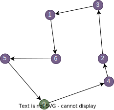
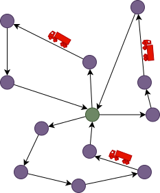
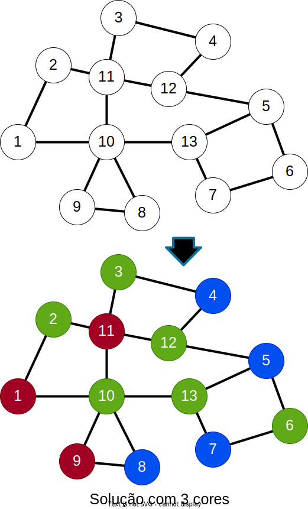
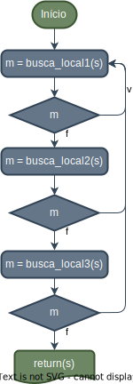

# <!-- fit --> Metaheurísticas 

Introdução e Conceitos Básicos

Albert E.F. Muritiba

---

## Introdução e Contextualização

- **Propósito:** Definir e contextualizar o campo de metaheurísticas e sua aplicação em problemas de otimização combinatória.

- **Relevância:** Problemas de otimização combinatória são comuns em diversos campos, como logística, engenharia e computação.

- **Abordagem:** Expor os conceitos básicos e características das metaheurísticas, bem como sua aplicação em problemas práticos.

---

### Bibliografia

- Glover, Fred W., and Gary A. Kochenberger, eds. **Handbook of metaheuristics**. Vol. 57. Springer Science & Business Media, 2006.
- Talbi, El-Ghazali. **Metaheuristics: from design to implementation**. Vol. 74. John Wiley & Sons, 2009.
- Michalewicz, Zbigniew, and David B. Fogel. **How to solve it: modern heuristics**. Springer Science & Business Media, 2013.

---

### Avaliação

- **Provas Escritas:** Duas avaliações escritas ao longo do semestre. 
- **Projeto Final:** Resolução de um problema de otimização combinatória utilizando metaheurísticas. 

$$Nota = \frac{p_1+p_2+pf}{3}$$

---

### Linguagem de Programação

- Os exemplos serão desenvolvidos em **Python**. 
- Embora **não seja a linguagem adequada**, Python é de fácil entendimento e rápida prototipação.
- O projeto final pode ser desenvolvido em qualquer linguagem de programação "não obscura".
- Tentaremos atingir o máximo de performance possível, mas sem otimizações extremas.

---
## Otimização combinatória

- Um problema combinatório é aquele cuja solução pode ser representada na forma de uma sequência de decisões discretas. 
- **Otimização Combinatória:** Ramo da matemática que lida com a busca da melhor solução para um problema combinatório.

---

## Relevância dos Problemas de Otimização Combinatória

- **Aplicações Práticas:** Exemplos incluem roteamento de veículos, escalonamento de produção e design de redes.
- **Complexidade:** O grande número de possíveis soluções torna a busca pelo ótimo uma tarefa árdua.
- **Impacto Econômico:** Soluções eficientes podem levar a economias significativas de recursos e tempo.

---

## Exemplos

- **Caixeiro Viajante (TSP)** 
- **Roteamento de Veículos (VRP)** 
- **Problema de Corte ou Empacotamento (BPP)**
- **Coloração de Grafos (GCP)**

---
### Caixeiro Viajante (TSP)

*Traveling Salesman Problem*.
- Dado um conjunto de cidades e as distâncias entre elas, encontrar o **menor ciclo que visita cada cidade**.
- Problema clássico de otimização combinatória, com aplicações em logística, transporte e telecomunicações.
  

---
### Roteamento de Veículos (VRP)

*Vehicle Routing Problem*.
- Dado um conjunto de clientes, suas demandas e um conjunto de veículos, encontrar **rotas para os veículos que atendam a todos os clientes**.
- Problema comum em logística, distribuição e transporte.
- Variantes incluem VRP com janelas de tempo, VRP com capacidade limitada, etc.

---

### Problema de Corte ou Empacotamento

*Bin Packing Problem*.
- Dado um conjunto de itens e seus *tamanhos*, encontrar **a menor quantidade de pacotes que acomode todos os itens**.
- Problema comum em logística, transporte, corte e armazenamento.

---

### Coloração de Grafos

*Graph Coloring Problem*.
- Dado um grafo, encontrar **a menor quantidade de cores necessárias para colorir os vértices de forma que vértices adjacentes tenham cores diferentes**.
- Problema comum em alocação de recursos, escalonamento e design de redes.

---

## Modelagem

- O primeiro passo para resolver computacionalmente um problema real é sua modelagem.
- Um modelo nunca será igual ao problema original, sempre haverão simplificações.
- Um modelo útil deve ser simples o bastante para ser resolvido, e preciso o suficiente para que seu resultado possa ser aplicado.

---
<!-- _class: invert  -->
<!-- _backgroundImage: false) -->

"Todos os modelos são errados, mas alguns são **úteis**!"
--
George Box

---

## Abordagens para Resolver Problemas de Otimização Combinatória

- **Métodos Exatos:** Algoritmos que garantem a solução ótima, mas podem ser inviáveis para problemas grandes.
- **Métodos Aproximados:** Estratégias que buscam soluções de boa qualidade, mas não necessariamente ótimas.
- **Heurísticas:** Técnicas que exploram **informações específicas do problema** para guiar a busca por soluções.
- **Metaheurísticas:** Estratégias **gerais e flexíveis** que podem ser aplicadas a uma ampla variedade de problemas.
  
---

## Métodos Exatos

- **Enumeração Exaustiva:** Avalia todas as possíveis soluções para encontrar a melhor.
- **Programação Dinâmica:** Explora a estrutura recursiva do problema para evitar recálculos redundantes.
- **Programação Linear Inteira:** Formula o problema como um modelo de programação linear com variáveis inteiras, para posterior resolução usando algoritmos especializados, e.g *Branch and Bound*, *Branch and Cut*, etc.
> **Vantagens:** Garantem a solução ótima, quando encontrada.

>**Desvantagens:** Podem ser inviáveis para problemas grandes devido à complexidade computacional.
---

## Métodos Aproximados e Heurísticos

- **Métodos Aproximados:** Buscam soluções de boa qualidade, mas não necessariamente ótimas, em tempo razoável.
- **Heurísticas:** Estratégias que exploram informações específicas do problema para guiar a busca por soluções.
>**Vantagens:** Permitem lidar com problemas complexos de forma eficiente, mesmo sem garantias de otimalidade.

>**Desvantagens:** Podem não encontrar a solução ótima, mas são úteis para problemas práticos.

---

<!-- _class: invert  -->
<!-- _backgroundImage: false) -->
"Melhor **aproximadamente** agora, do que **exatamente** nunca!"
-

Desconhecido

---

##  Desafios

- **Combinatorialidade:** Número exponencial de possíveis soluções. Analisar todas as possibilidades de um TSP com 20 cidades levaria **77 anos**, avaliando  **1 bilhão** de soluções por segundo.
- **Complexidade Computacional:** Muitos problemas são NP-difíceis, o que significa que **não existe algoritmo  conhecido** para resolvê-los de forma exata sem que o tempo de execução **cresça exponencialmente** com o tamanho da entrada.
- **Restrições:** Problemas reais frequentemente possuem restrições adicionais, como capacidade, janelas de tempo, conflitos, etc.

---

## Metaheurísticas

- **Definição:** Estratégias genéricas e flexíveis para resolver problemas de otimização.
- **Características:** 
  - Não garantem a solução ótima,
  - são estoquásticas, i.e., usam aleatoriedade,
  - o seu tempo de execução é controlável,
  - a qualidade da solução depende da configuração, *tunning*, de alguns parâmetros e do número de iterações.

---

##  Conceitos Básicos

A seguir, apresentamos alguns conceitos fundamentais para o projeto e implementação de metaheurísticas.

---
### Representação
Como as soluções serão representadas. Aspetos a considerar:
- **Computacinal:** Qual estrutura de dados será usada para implementar as soluções.
  - Afeta a complexidade de memória e tempo de execução dos procedimentos.
  - Deve ser eficiente para manipular e avaliar as soluções.
- **Conceitual:** Como as soluções são interpretadas. Idealmente devem:
  - Representar todas as possíveis soluções.
  - Evitar soluções inválidas.
  - Evitar simetrias, i.e., uma mesma solução representada de formas diferentes.

---
As metaheurísticas dependem de iterações sucessivas para encontrar a melhor solução. Se a representação for ineficiente, o resultado será um algoritmo lento e ineficaz.
-

> Reavaliar a representação é uma etapa importante para melhorar o desempenho de uma metaheurística.
---
<!-- _class: invert  -->
<!-- _backgroundImage: false) -->

"A otimização prematura é a raiz de todo mal!"
--
Donald Knuth

---

Exemplo de representação para o problema do **Caixeiro Viajante**:

- **Array de Inteiros:** 
  - **Sequencial:** $v_i$ é a i-ésima cidade na rota [0, 4, 2, 3,1]
    - Fácil de interpretar e manipular.
    - Remover ou adicionar cidades é feito em $O(n)$.
  - **Link:** $n_i$ é a proxima cidade a ser visitada após a cidade $i$ [4,0,3,1,2]
    - Menos intuitivo, mas mais eficiente para operações de vizinhança.
    - Remover ou adicionar cidades é feito em $O(1)$.

---

- **Matriz de Adjacência:**
  - **Binária:** $a_{ij} = 1$ se a cidade $i$ é vizinha da cidade $j$.
    - Desperdício de memória, complexidade $O(n^2)$.
    - Evita simetrias, mas não é eficiente para manipulação.
    - Mais adequado para abordagem por programação matemática.

  

---

  Exemplo de representação para o problema de Empacotamento:

- **Array de Inteiros:** $p_i$ é o pacote que contém o item $i$ [1, 2, 1, 3, 2]
  - Fácil de interpretar e manipular.
  - Remover ou adicionar itens é feito em $O(1)$.
  - Apresenta muitas simetrias. Cada solução possui $m!$ representações diferentes.
- **Lista de Listas:** $p_i$ é a lista de itens no pacote $i$ [[1,3], [2,5], [4], [6], [7,8]]
  - Implementação mais complexa, demanda mais memória.
  - Remover ou adicionar itens é feito em $O(n)$ dependendo da implementação.

---
- **Matriz de Adjacência:**
  - **Binária:** $a_{ij} = 1$ se os items $i$ e $j$ estão no mesmo pacote.
    - Desperdício de memória, complexidade $O(n^2)$.
    - Evita simetrias, mas é difícil de interpretar, manipular e avaliar.

---
### Espaço de Busca

O que faz das metaheurísticas uma abordagem genérica é o fato de serem projetadas para resolver o **problema de busca**

- **Problema de Busca:** Dado um conjunto de soluções, encontrar a melhor solução de acordo com um critério de otimização.
- **Espaço de Busca:** Conjunto de todas as possíveis soluções para um problema.

> As metaheurísticas não são descritas em termos de um problema específico, mas sim em termos de um **espaço de busca**.

---
Em geral, usamos espaços de busca para descrever de forma metafórica o funcionamento de uma metaheurística.
- Gráfico 2D: Espaço de busca x Qualidade da solução.
- Gráfico mapa de calor: Espaço de busca (2D) x Função objetivo (gradiente de cor). 

---
### Função Objetivo

- **Função Objetivo:** Função que atribui um valor numérico a cada solução candidata, representando sua qualidade de acordo com o critério de otimização.
- **Função de Avaliação:** Certas abordagens de otimização, adaptam a função objetivo para uma função de avaliação, que é uma função que não necessariamente representa a qualidade da solução, mas sim a adequação da solução para a metaheurística.

---
Um bom exemplo é o da função objetivo para o BPP:
- **Função Objetivo:** Minimizar o número de pacotes usados. Pequenas modificações na solução quase nunca resultam em uma solução melhor.
- **Função de Avaliação 1:** Maximizar a soma dos quadrados das cargas dos pacotes. Assim, soluções com pacotes mais próximos de serem completados ou esvaziados são mais bem avaliadas.
- **Função de Avaliação 2:** Algumas abordagens permitem soluções inviáveis, e a função de avaliação é usada para penalizar soluções inviáveis.
---

### Vizinhança

Conjunto de soluções que são "próximas" de uma solução dada.
- Um vizinho é obtido a partir de uma solução atual por meio de uma "pequena" modificação.
- A vizinhança de uma solução é uma escolha **arbitrária** por parte do projetista da metaheurística.
- Definir uma boa vizinhança é crucial para o desempenho da metaheurística.  

---
### Operadores de Vizinhança
São rotinas que **definem como gerar vizinhos** a partir de uma solução atual. Exemplos para o **TSP**:
- **Swap:** Troca a ordem de duas cidades na rota.
  - [0, 1, **2**, 3, **4**] -> [0, 1, **4**, 3, **2**]
- **2-Opt:** Inverte a ordem de um subconjunto de cidades na rota.
  - [0, 1, **2, 3, 4**] -> [0, 1, **4, 3, 2**]
- **Insertion:** Remove uma cidade da rota e a insere em outra posição.
  - [0, 1, **2**, 3, 4] -> [0, 1, 3, 4, **2**]
- **Or-Opt:** Remove um subconjunto de cidades da rota e as insere em outra posição.
  - [0, 1, **2, 3**, 4] -> [0, 1, 4, **2, 3**]

---
### Princípio da Localidade

A ideia de que soluções de alta qualidade tendem a estar próximas umas das outras no espaço de busca.
- Pequenas modificações em uma solução de alta qualidade devem resultar em soluções de qualidade semelhante.
- Se a função objetivo for muito sensível ou nada sensível a pequenas modificações, as metaheurísticas podem não ser eficazes.
- Nestes casos podemos usar um função de avaliação ou trocar a natureza das modificações.
  
---
### Ótimo Global e Ótimo Local

- **Ótimo Global:** A melhor solução possível para um problema de otimização.
- **Ótimo Local:** Uma solução que é a melhor em sua vizinhança, mas não necessariamente a melhor globalmente.

> O desafio das metaheurísticas é encontrar o ótimo global, evitando ficar preso em ótimos locais.

---
### Método Construtivo

As metaheurísticas precisam de um ponto de partida para iniciar a busca. 

- **Definição:** Abordagem que constrói uma solução passo a passo, adicionando elementos de acordo com um critério específico.
- Na maioria das vezes, criar uma solução viável não é complicado,
- Em certos casos, criar umas solução viável pode ser um problema em si. Neste casos podemos admitir soluções inviáveis e corrigi-las posteriormente.
- Comumente temos métdos construtivos:
  - Totalmente aleatórios.
  - Gulosos,
  - Guloso Randomizado.  
---
### Busca Local e Métodos de Descida

A maior parte das metaheurísticas usam a busca local como um componente fundamental.

- **Busca Local:** Estratégia que explora a vizinhança de uma solução atual para encontrar uma solução melhor.
- **Métodos de Descida:** Algoritmos que exploram a vizinhança de uma solução atual e se movem para um vizinho melhor, até que não haja mais melhorias possíveis (**ótimo local**). Conhecidos também como *hill climbing*.
---

- A solução inicial pode ser gerada por um método construtivo ou dada como entrada.
- A `busca_local` explora a vizinhança da solução atual e, caso encontre uma solução melhor, atualiza a solução atual e retorna `True`.

---

- **VND:** *Variable Neighborhood Descent*, é um método que alterna entre diferentes vizinhanças para explorar o espaço de busca.
- O fluxograma mostra um exemplo de VND com três vizinhanças diferentes.
- A ordem e o número de vizinhanças podem impactar o desempenho do algoritmo.

---
### Intensificação vs Diversificação
<!-- _footer: ' ' -->
Um conceito que lidamos no projeto de metaheurísticas é a **intensificação** vs **diversificação**.

- **Intensificação:** Concentrar a busca em torno de regiões promissoras do espaço de busca.
- **Diversificação:** Explorar diferentes regiões do espaço de busca para evitar ficar preso em ótimos locais.

- Se um método demora muito para apresentar um bom resultado, pode ser que ele esteja muito diversificado
- Se um método não apresenta melhores soluções mesmo aumentando o número de iterações, pode ser que ele esteja muito intensificado.
> O desafio é encontrar um equilíbrio entre intensificação e diversificação para encontrar o ótimo global.
---
### Metaheurísticas Populares
Há muitas metaheurísticas diferentes, cada uma com suas próprias características e aplicações.
- **s-Metaheuriticas**: Baseados em uma solução corrente:
  - RMS (Random Multi Start)
  - ILS (Iterated Local Search)
  - VNS (Variable Neighborhood Search)
  - GRASP (Greedy Randomized Adaptive Search Procedure)
  - TS (Tabu Search)
  - SA (Simulated Annealing)
  - GLS (Guided Local Search)
---
- **p-Metaheurísticas**: Baseados em uma população de soluções:
  - GA (Genetic Algorithm)
  - PSO (Particle Swarm Optimization)
  - ACO (Ant Colony Optimization)
  - EDA (Estimation of Distribution Algorithm)

> Nada impede de combinar diferentes metaheurísticas para resolver um problema, essa é uma abordagem comum e chamada de híbrida.
---

### Matheuristicas

- **Matheurísticas:** Combinação de métodos exatos e heurísticos para resolver problemas de otimização.
- **Vantagens:** Aproveitam a eficiência dos métodos exatos e a flexibilidade das heurísticas.
- **Desvantagens:** Podem ser mais complexas de implementar e ajustar do que métodos puramente heurísticos.
- **Exemplos:** Algoritmos híbridos que combinam programação linear inteira com busca local ou algoritmos genéticos.
- **Aplicações:** Problemas de otimização complexos que requerem uma abordagem mista para serem resolvidos de forma eficiente.

---

## Conclusão

- As metaheurísticas oferecem abordagens poderosas para enfrentar problemas desafiadores de otimização combinatória.
- Embora não garantam soluções ótimas, podem encontrar resultados satisfatórios em um tempo razoável.
- A compreensão dessas técnicas é essencial para resolver problemas do mundo real de forma eficiente.

